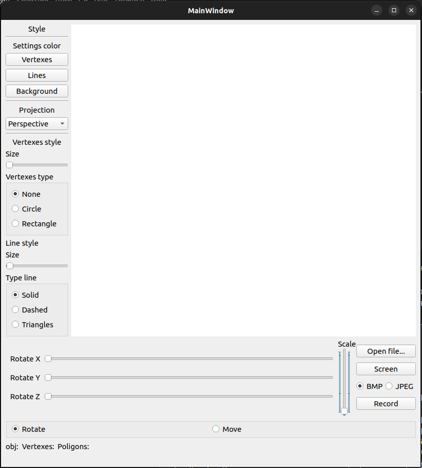
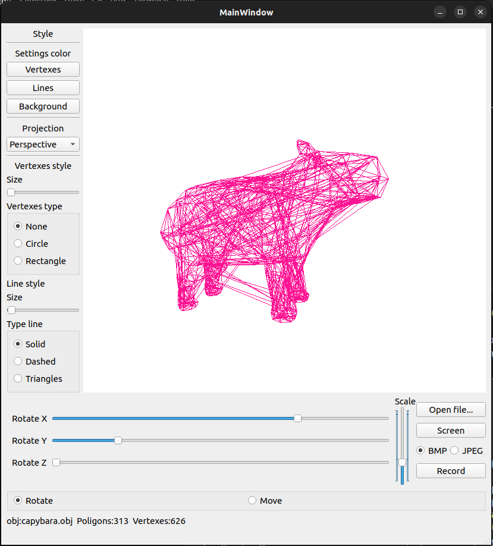

# 3DViewer v1.0

## Introduction

В данном проекте реализованы на языке программирования С программу для просмотра 3D моделей в каркасном виде (3D Viewer). Сами модели загружаются из файлов формата .obj и имеют возможность просматриваться на экране с возможностью вращения, масштабирования и перемещения.

## Установка

```
make install
./3DViewer
```

для сборки необходим Qt6

- интерфейс:


- капибара :)


### Формат представления описаний трехмерных объектов .obj

Файлы .obj - это формат файла описания геометрии, впервые разработанный компанией Wavefront Technologies. Формат файла открыт и принят многими поставщиками приложений для 3D-графики.

Формат файла .obj - это простой формат данных, который представляет только трехмерную геометрию, а именно положение каждой вершины, положение UV координат текстуры каждой вершины, нормали вершин и грани, которые определяют каждый многоугольник как список вершин и вершин текстуры. Координаты obj не имеют единиц измерения, но файлы obj могут содержать информацию о масштабе в удобочитаемой строке комментариев.

Пример файла формата .obj:
```
  # Список вершин, с координатами (x, y, z[, w]), w является не обязательным и по умолчанию равен 1.0
  v 0.123 0.234 0.345 1.0
  v ...
  ...
  # Текстурные координаты (u, v[, w]), w является не обязательным и по умолчанию 0
  vt 0.500 -1.352 [0.234]
  vt ...
  ...
  # Нормали (x, y, z)
  vn 0.707 0.000 0.707
  vn ...
  ...
  # Параметры вершин в пространстве (u[, v][, w])
  vp 0.310000 3.210000 2.100000
  vp ...
  ...
  # Определения поверхности (сторон)
  f v1 v2 v3
  f ...
  ...
  # Группа
  g Group1
  ...
  # Объект
  o Object1
```

В данном проекте реализована поддержка списка вершин и поверхностей

### Аффинные преобразования 

В данном разделе будут описаны базовые аффинные преобразования (перемещение, поворот, масштабирование) на плоскости на примере двумерных объектов (изображений). Аналогичным образом можно использовать аффинные преобразования и в случае трехмерного пространства.

Аффинное преобразование - отображение плоскости или пространства в себя, при котором параллельные прямые переходят в параллельные прямые, пересекающиеся — в пересекающиеся, скрещивающиеся — в скрещивающиеся. \
Преобразование плоскости называется аффинным если оно взаимно однозначно и образом любой прямой является прямая. Преобразование (отображение) называется взаимно однозначным (биективным), если оно переводит разные точки в разные, и в каждую точку переходит какая-то точка.

С алгебраической точки зрения аффинное преобразование это преобразование вида: _f(x) = M * x + v_, где _M_ - некая обратимая матрица, а _v_ - какое-то значение.

Свойства аффинных преобразований:
- Композиция аффинных преобразований есть снова аффинное преобразование.
- Преобразование, обратное к аффинному, есть снова аффинное преобразование.
- Отношение площадей сохраняется.
- Отношение длин отрезков на прямой сохраняется.

#### Перемещение 

Матрица перемещения в однородных двумерных координатах:
```
1 0 a
0 1 b
0 0 1
```

где _a_ и _b_ - величины по _x_ и _y_, на которые необходимо переместить исходную точку. Таким образом, чтобы переместить точку необходимо умножить матрицу перемещения на нее:
```
x1     1 0 a     x 
y1  =  0 1 b  *  y
1      0 0 1     1
```

где _x_ и _y_ - исходные координаты точки, а _x1_ и _y1_ - полученные координаты новой точки после перемещения.

#### Поворот

Матрица поворота по часовой стрелке в однородных двумерных координатах:
```
cos(a)  sin(a) 0
-sin(a) cos(a) 0
0       0      1
```

где _a_ - угол поворота в двумерном пространстве. Для получения координат новой точки необходимо также, как и матрицу перемещения, перемножить матрицу поворота на исходную точку:
```
x1     cos(a)  sin(a) 0     x 
y1  =  -sin(a) cos(a) 0  *  y
1      0       0      1     1
```

#### Масштабирование

Матрица масштабирования в однородных двумерных координатах:
```
a 0 0
0 b 0
0 0 1
```

где _a_ и _b_ - коэффициенты масштабирования соответственно по осям OX и OY. Получение координат новой точки происходит аналогично описанным выше случаям.

## Part 1. 3DViewer

Разработать программу для визуализации каркасной модели в трехмерном пространстве:

- Программа разработана на языке С стандарта C11 с использованием компилятора gcc. Допустимо использование дополнительных библиотек и модулей QT
- Сборка программы настроена с помощью Makefile со стандартным набором целей для GNU-программ: all, install, uninstall, clean, dvi, dist, tests, gcov_report. Установка вестись в любой другой произвольный каталог
- Программа разработана в соответствии с принципами структурного программирования
- При написании кода необходимо придерживаться Google Style
- Обеспечено покрытие unit-тестами модулей, связанных с загрузкой моделей и аффинными преобразованиями
- В один момент времени только одна модель на экране.
- Программа предоставляет возможность:
    - Загружать каркасную модель из файла формата obj (поддержка только списка вершин и поверхностей).
    - Перемещать модель на заданное расстояние относительно осей X, Y, Z.
    - Поворачивать модель на заданный угол относительно своих осей X, Y, Z
    - Масштабировать модель на заданное значение.
- В программе реализован графический пользовательский интерфейс, на базе любой GUI-библиотеки с API для C89/C99/C11 <br/>
  * For Linix: GTK+, CEF, Qt<br/>
  * For Mac: GTK+, Nuklear, raygui, microui, libagar, libui, IUP, LCUI, CEF, Qt
- Графический пользовательский интерфейс содержит:
    - Кнопку для выбора файла с моделью и поле для вывода его названия.
    - Зону визуализации каркасной модели.
    - Кнопку/кнопки и поля ввода для перемещения модели. 
    - Кнопку/кнопки и поля ввода для поворота модели. 
    - Кнопку/кнопки и поля ввода для масштабирования модели.  
    - Информацию о загруженной модели - название файла, кол-во вершин и ребер.

## Part 2. Дополнительно. Настройки

 - Программа позволяет настраивать тип проекции (параллельная и центральная)
 - Программа позволяет настраивать тип (сплошная, пунктирная), цвет и толщину ребер, способ отображения (отсутствует, круг, квадрат), цвет и размер вершин
 - Программа позволяет выбирать цвет фона
 - Настройки сохраняются между перезапусками программы

 ## Part 3. Дополнительно. Запись

 - Программа позволяет сохранять полученные («отрендеренные») изображения в файл в форматах bmp и jpeg
 - Программа позволяет по специальной кнопке записывать небольшие «скринкасты» - текущие пользовательские аффинные преобразования загруженного объекта в gif-анимацию (640x480, 10fps, 5s)
